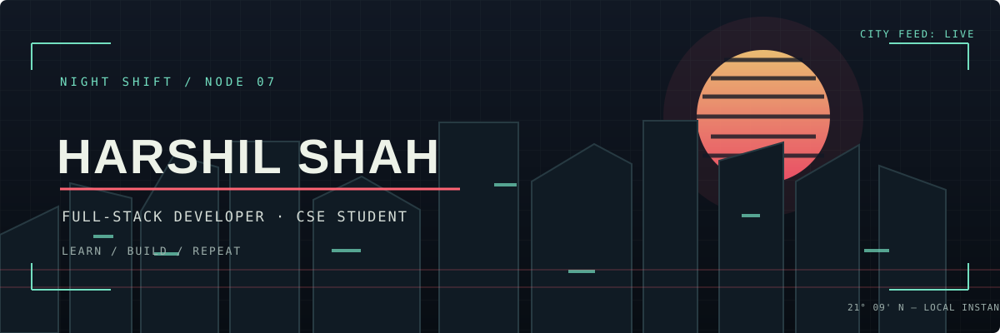
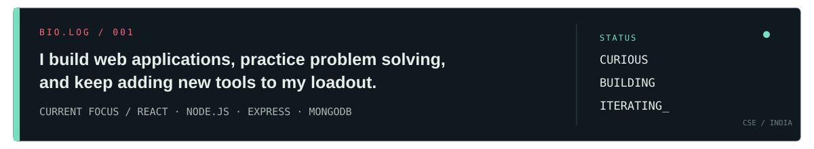
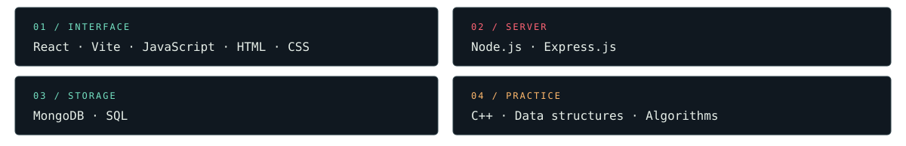
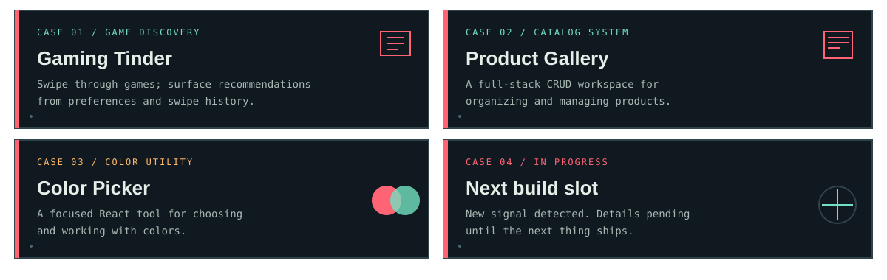
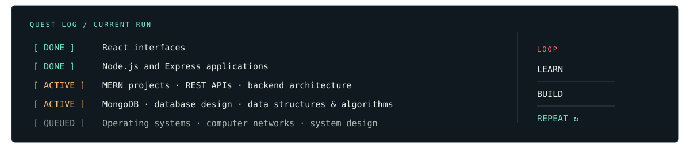

 

  

Plain-text profile (screen readers and search)

**Harshil Shah** is a CSE student and full-stack developer. He builds web applications, practices problem solving, and keeps adding new tools to his loadout. He is currently focused on React, Node.js, Express, and MongoDB.

**Current stack:** React, Vite, JavaScript, HTML, CSS · Node.js, Express · MongoDB, SQL · C++ for data structures and algorithms.

**Projects:**
- Gaming Tinder — game discovery with recommendations based on preferences and swipe history.
- Product Gallery — full-stack product management app.
- Color Picker — a small frontend utility for selecting and working with colors.

**Learning now:** MERN projects, REST APIs, backend architecture, database design, data structures and algorithms, operating systems, computer networks, and system design fundamentals.

**Profiles:** [Codeforces](https://codeforces.com/profile/shahharshil393) · [LeetCode](https://leetcode.com/u/shahharshil393) · [LinkedIn](https://www.linkedin.com/in/harshil-shah-421852420/) · [Email](mailto:shahharshil393@gmail.com)

