


 

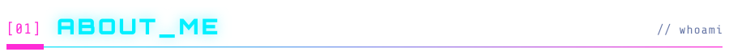


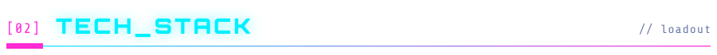


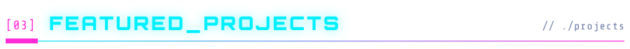
<a href = "https://github.com/Harshil607/Gaming-Tinder">
</a>
<a href="https://github.com/Harshil607/Product-Gallery">
</a>
<a href = "https://github.com/Harshil607/Color-Picker">
</a>

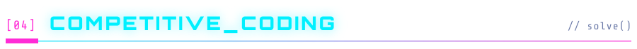


  

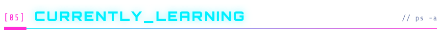


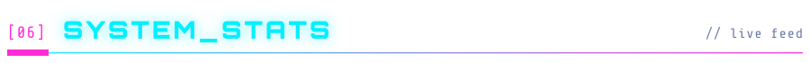




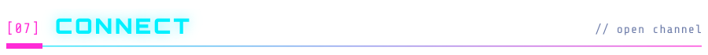

  

Plain-text summary (for screen readers &amp; search)

 

**Harshil Shah** is a full-stack developer, competitive programmer and CSE student. He builds web applications, solves problems and keeps learning new technologies.

**Focus:** full-stack web development with React, Node.js, Express.js, MongoDB and SQL; data structures and algorithms in C++; strengthening operating systems and computer networks; building full-stack projects from scratch.

**Projects**

- **Gaming Tinder**: a Tinder-inspired full-stack app where users swipe left or right on games and get recommendations based on their preferences and swipe history. React, Node.js, Express.js, MongoDB.
- **Product Gallery**: a full-stack CRUD app for managing products, with a React frontend and a Node/Express backend. React, Node.js, Express.js, MongoDB.
- **Color Picker**: a React application for selecting and working with colors. React, JavaScript, CSS.

**Stack:** C, C++, JavaScript, HTML5, CSS3 · React, Vite · Node.js, Express.js · MongoDB, SQL · Git, GitHub, VS Code

**Currently learning:** MERN stack, REST APIs and backend architecture, MongoDB and database design, data structures and algorithms, operating systems, computer networks, software engineering and system design fundamentals.

**Links:** [Codeforces](https://codeforces.com/profile/shahharshil393) · [LeetCode](https://leetcode.com/u/shahharshil393) · [Email](mailto:shahharshil393@gmail.com) · [LinkedIn](https://www.linkedin.com/in/harshil-shah-421852420/)

